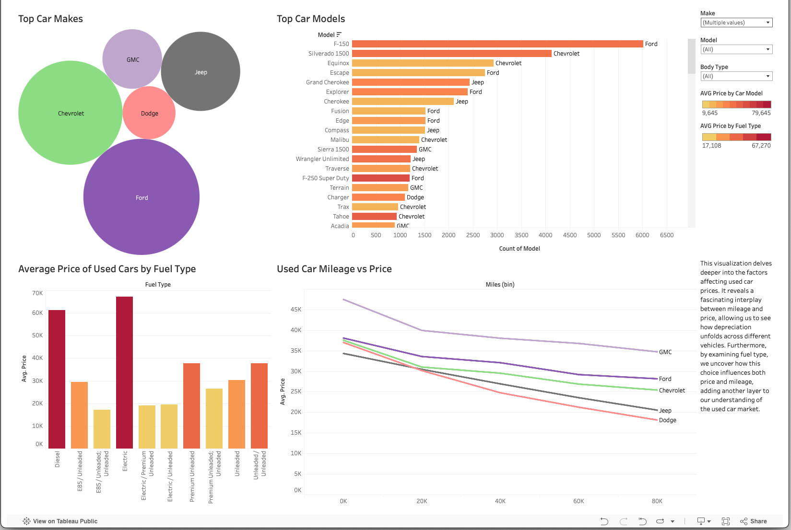
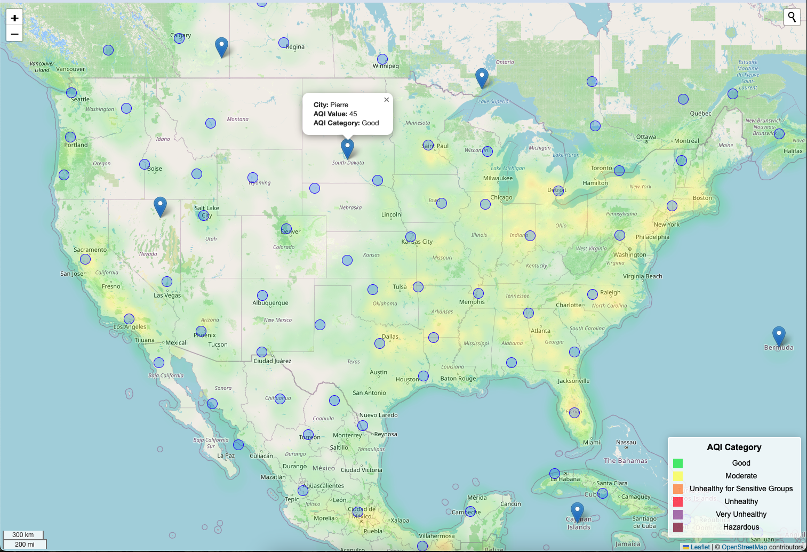
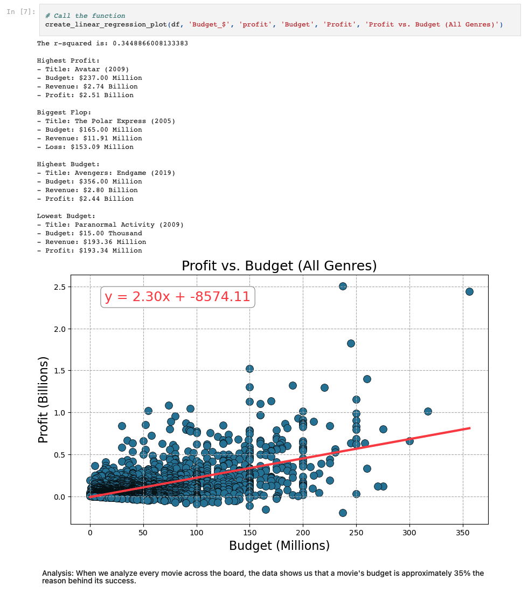
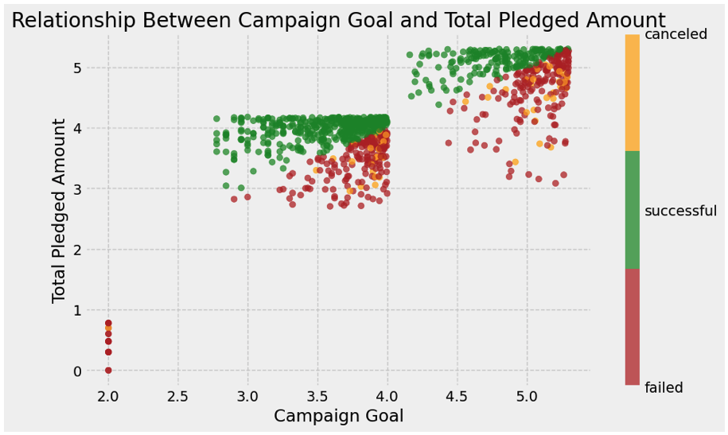

# Andrew Vick — Data Analyst

📧 andrew.vick@me.com &nbsp;|&nbsp; 📍 Houston, TX &nbsp;|&nbsp; [LinkedIn](https://www.linkedin.com/in/andrew-m-vick)

---

## About Me

Hi, I'm Andrew Vick — a data analyst based in Houston, TX with a certificate in Data Analytics & Visualization from Rice University. My work spans the full stack: Python and SQL for analysis, Tableau and Plotly for visualization, and Flask and JavaScript for building interactive web applications.

I bring a practical lens to data problems — having run my own business, I understand how analytical work translates into real operational decisions. I'm currently pursuing a BBA in Finance at the University of Houston-Downtown to deepen my quantitative foundation.

---

## Skills

- **Languages:** Python, SQL, JavaScript, VBA
- **Libraries & Frameworks:** Pandas, NumPy, Matplotlib, Scikit-Learn, PySpark, Flask, SQLAlchemy, Leaflet
- **Databases:** MySQL, PostgreSQL, MongoDB, SQLite
- **Visualization:** Tableau, Power BI, Matplotlib, Plotly
- **Platforms & Tools:** AWS, Databricks, Jupyter, VS Code, Git, ETL pipelines, Bootstrap

---

## Projects

### 🚗 [Used Car Price Predictor](https://github.com/andrew-m-vick/project-4-group-01)
Consumers and dealerships often lack reliable tools to assess fair used car pricing. Built a full-stack web application that predicts used car prices based on make, model, year, mileage, and fuel type using a trained machine learning model. Developed the front-end and back-end with Flask, integrated the ML model into the live application, and created a Tableau Story for interactive data exploration.

**Tools:** Python, Flask, Scikit-Learn, Tableau, HTML, CSS, JavaScript, Jupyter Notebook

---

### 🌍 [Air Quality Web App](https://github.com/andrew-m-vick/project-3-group-08)
Air pollution data is widely collected but rarely made accessible in an intuitive way. Developed an interactive web application that visualizes global air quality data through dynamic maps and charts. Led the development of the interactive map — the centerpiece of the application — enabling users to explore pollution levels spatially across countries and regions.

**Tools:** Python, Flask, SQL, SQLite, JavaScript, HTML, CSS, Jupyter Notebook

---

### 🎬 [Film Industry Analysis](https://github.com/andrew-m-vick/project-1-group-18/blob/main/Andrew-Regression/Project1_Base_VICK.ipynb)
The relationship between a film's production budget and its profitability is widely assumed but rarely quantified across genres. Analyzed film industry data to reveal box office trends and key performance indicators across genres, distributors, and budget tiers. Spearheaded regression modeling to measure the statistical relationship between budget and profit at the genre level.

**Tools:** Python, Pandas, Matplotlib, Jupyter Notebook

---

### 🗃️ [Crowdfunding ETL Pipeline](https://github.com/andrew-m-vick/Crowdfunding_ETL)
Raw crowdfunding data is messy and siloed, making it difficult to identify what separates successful campaigns from failed ones. Designed a relational database and end-to-end ETL pipeline to extract, transform, and load crowdfunding data for structured analysis. Drove the full analysis — querying the database, building visualizations, and surfacing trends to inform strategic decision-making.

**Tools:** SQL, PostgreSQL, Pandas, NumPy, Matplotlib, QuickDBD, Jupyter Notebook

