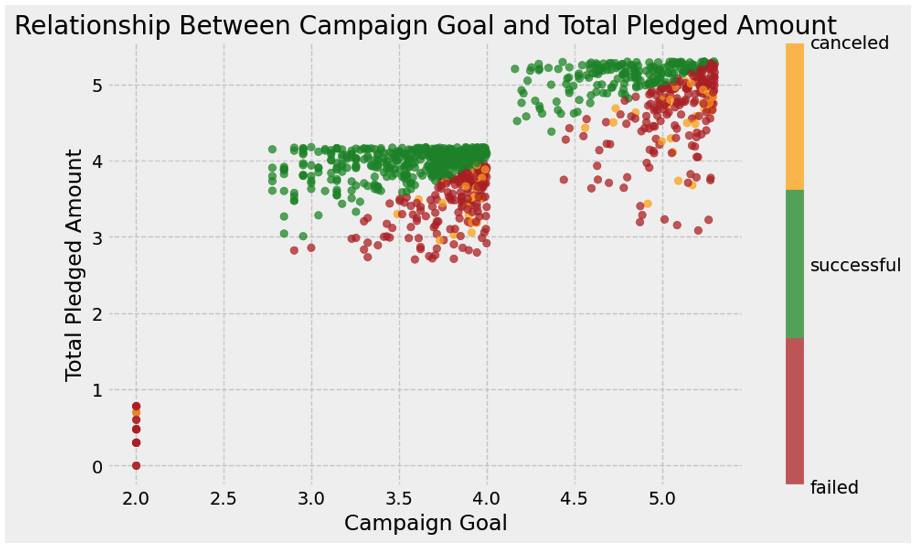

# About Me

**Resume:** [https://docs.google.com/file/d/1AedoIY4MqNv7SLPPyh6yyQFtxi7tGpLW/edit?usp=docslist_api&filetype=msword](https://docs.google.com/file/d/1AedoIY4MqNv7SLPPyh6yyQFtxi7tGpLW/edit?usp=docslist_api&filetype=msword)

**LinkedIn:** [https://www.linkedin.com/in/andrew-m-vick](https://www.linkedin.com/in/andrew-m-vick)

  Hi there! I'm Andrew Vick, a data analyst with a passion for transforming raw data into actionable insights. I thrive on uncovering the stories hidden within complex datasets and using them to drive strategic decision-making.
  My toolkit includes Python, SQL, and a variety of data visualization tools. I have a proven track record of leveraging data to fuel business growth and optimize operational efficiency. Whether it's analyzing industry trends, building a database, or visualizing data, I love tackling diverse projects that challenge me to learn and grow.
  My background in the restaurant industry has given me a unique perspective on the power of data. I've seen firsthand how data-driven insights can improve everything from inventory management to customer satisfaction.
  I'm excited to continue my journey in the world of data. I'm always eager to learn new techniques and tackle new challenges.

## Skills
-	**Programming Languages:** Python, SQL, JavaScript, VBA
-	**Databases:** MySQL, MongoDB, PostgreSQL, NoSQL
-	**Data Analysis and Visualization:** Pandas, NumPy, Matplotlib, Tableau, Jupyter Notebook
-	**Web Development:** HTML, CSS, Bootstrap, Flask, Leaflet
-	**Other:** ETL, PySpark, API Interactions, Git, GitHub

## Projects
-	**[Film Industry Analysis](https://github.com/andrew-m-vick/project-1-group-18/blob/main/Andrew-Regression/Project1_Base_VICK.ipynb):** Applied Python to analyze film industry data, revealing box office trends and key performance indicators.
  
  
  
-	**[Crowdfunding ETL](https://github.com/andrew-m-vick/Crowdfunding_ETL):** Designed and implemented a crowdfunding database using SQL, uncovering crucial trends in crowdfunding campaigns.
  
  
  
-	**[Air Quality Visualization](https://github.com/andrew-m-vick/project-3-group-08):** Collaborated on an interactive web application to visualize global air quality data, raising awareness of pollution's impact.
  
  

- **[Citibike Ridership Analysis](https://github.com/andrew-m-vick/tableau_citibike_2023):** Applied Tableau to visualize and analyze Citibike ridership data, revealing key insights into seasonal trends, commuting behaviors, station popularity, and geographic distribution.

